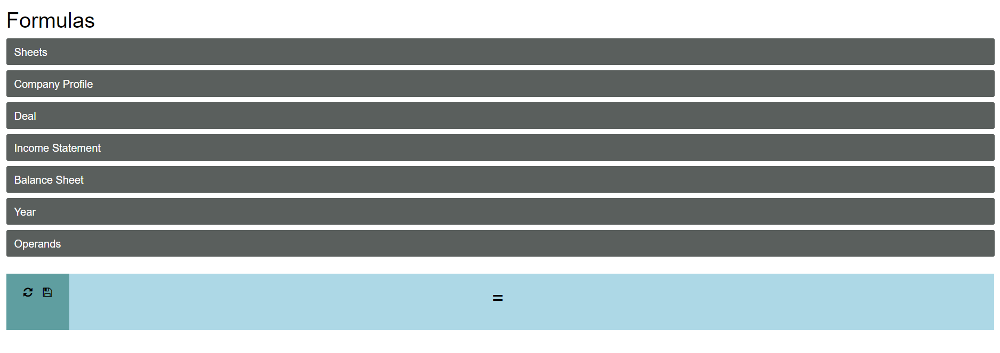

# formula

## Overview
Formula has been designed and developed for Nick Cellura to inspect and work with financial information from various google sheets. It computes the sum and averages and also provides a way to collate information from multiple google sheets. Sheets can be filtered by certain topline filters.

## Dependencies
sudo pip3 install flask httplib2 google-python-api-client oauth2client gspread gspread_dataframe

## Installation
git clone https://github.com/nickcellura/nickcellura.git

## Run
sudo python3 sheets.py >> log.txt 2>&1 &

## Features
Formula has been designed to work with Google Authentication using oAuth. A client_secrets.json file needs to exist in this directory. Client secrets can be created on Google console and the redirects should use:
> https://noelteey.com:80/oauth2callback

### Getting Started
The user needs to authenticate using their Google username and password. Formula automatically pulls all google sheets under the folder:
> Model Analysis

All sheets appear for selection under the sheets row.

### Sheet selection

